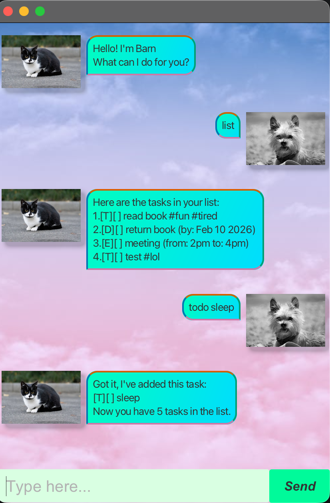

# Barn User Guide

## Introduction
This is a chatbot that serves as a todo list. It helps you to keep track of 
future tasks, events, and deadlines.

## Adding tasks
To add a task , type in todo (task name)

Example: `todo borrow book`

A todo task will be added to the list

## Adding deadlines

To add a task with a deadline, type in deadline (task name) /by (deadline date)

Example: `deadline return book /by tomorrow`

A deadline task will be added to the list

## Add events

To add an event task, type in event (event name) /from (start time) /to (end time)

Example: `event meeting /from 1pm /to 2pm`

An event task will be added to the list

## Show all items in task list

To show all items currently in list, simply type in `list`

## Mark done
To mark an item as done, type in mark, followed by the index of the task to be marked as done.\
Example: `mark 3`

## Mark as not done
Similarly, you can mark an item as not done by using unmark.
Example: `unmark 3`

## Delete task 
To delete a task, type in delete followed by the index of the task to be deleted.\
Example: `delete 2`

## Find task
To find a task with matching keyword, type in find followed by the keywords. This will find events that
contain the keyword in the description.\
Example: `find book`

## Tagging tasks
You can also tag tasks by adding #tagname to the end of any add command.\
Example: `todo borrow book #fun`